* [BiometricAuthFrontend](#biometricauthfrontend)
* [Setup](#setup)
* [Installation](#installation)
* [User Guide](#user-guide)
   * [Registration](#registration)
   * [Login](#login)
   * [Biometric Login](#biometric-login)
   * [Personal Area](#personal-area)
   * [Refresh](#refresh)
   * [Logout](#logout)
   * [Biometric Enrollment](#biometric-enrollment)
* [Architecture](#architecture)
   * [POJO](#pojo)
   * [Authenticator](#authenticator)
   * [Biometric Prompt](#biometric-prompt)
   * [Android KeyStore](#android-keystore)
   * [Biometrics Enrollment Flow](#biometrics-enrollment-flow)
   * [Biometric Login Flow](#biometric-login-flow)


# BiometricAuthFrontend
Demo Android application to show biometric authentication using PyAuthBackend.

Setup
=====
Application is configured to connect to a specific URL specified in
the file:
```
app/src/main/java/com/adriano/biometricauthfrontend/rest/clients/
PyAuthBackendRESTClient
```
Using the variable:
```java
private static final String BASE_URL = "https://
                            adrianodd.pythonanywhere.com/api/";

```
By default, it will connect to this site which has a valid
SSL certificate and the application will work without any
problem.
If the server is ran without a certificate or has a self-signed
certificate, Android will block any attempt to connect to it.
In order to workaround this issue the Manifest file must be
modified by adding the following line:
```xml
android:networkSecurityConfig="@xml/network_security_config"
```
Then the file network_security_config,found at res/xml/
must be updated with the following data:
```xml
<?xml version="1.0" encoding="utf-8"?>
<network-security-config><base-config cleartextTrafficPermitted="true" />
    <domain-config cleartextTrafficPermitted="true">
        <domain includeSubdomains="true">
          Ip-Address Of the Server
        </domain>
    </domain-config>
</network-security-config>
```
this will force application to connect trough http without
any complaint from the system network policy.

Installation
============
You can either install it using AndroidStudio by setting the
phone/emulator in debug mode and running directly from there or
you can use the self-signed apk found in the app/release folder by
copying directly to your phone and installing from there.
**NOTE that built APK uses a default URL which is available online at: [adrianodd.pythonanywhere.com](https://adrianodd.pythonanywhere.com)**

User Guide
==========

After installing it for the first time, user will be presented by the main
fragment asking either to login or register a new account:
<p align="center">
    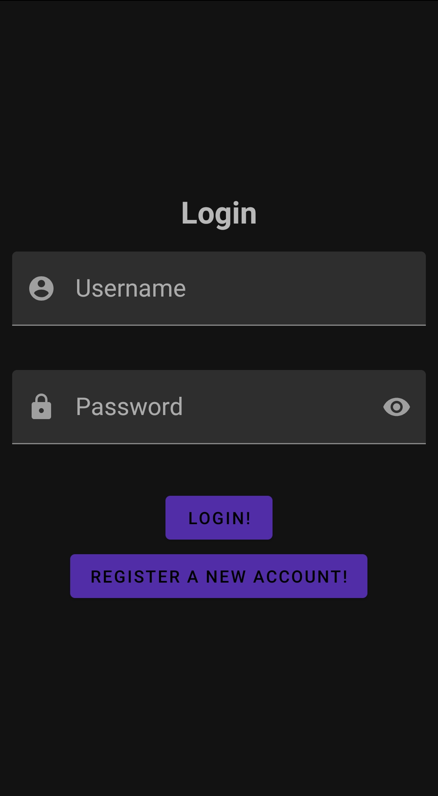
    <br>
    <em>Main UI</em>
</p>

Registration
------------
If the user wants to register a new account then the
following screen is shown asking to input all the details:
<p align="center">
    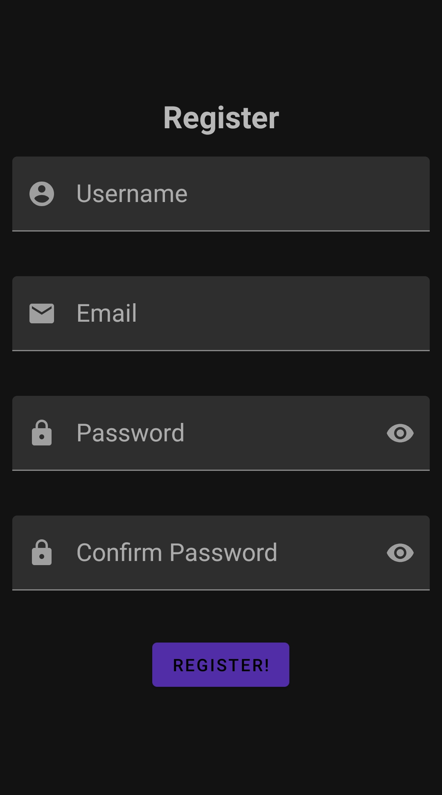
    <br>
    <em>Registration</em>
</p>

If one of the required fields is empty or not valid, it will show a
warning error as seen below:

<p align="center">
    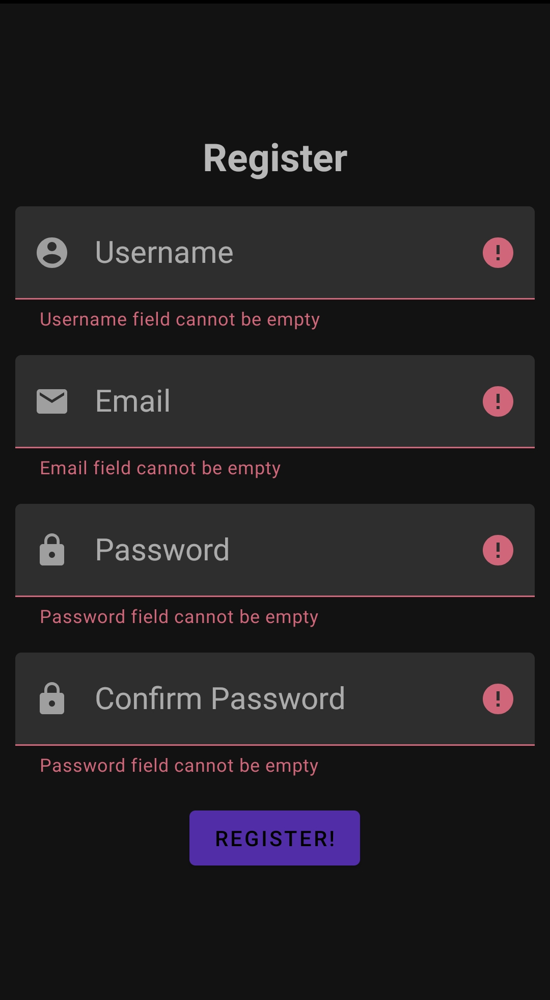
    <br>
    <em>Registration Errors</em>
</p>

Fields are also parsed server side, this means that if the user or mail
already exists, when clicking register, server will return an error code
as seen below:

<p align="center">
    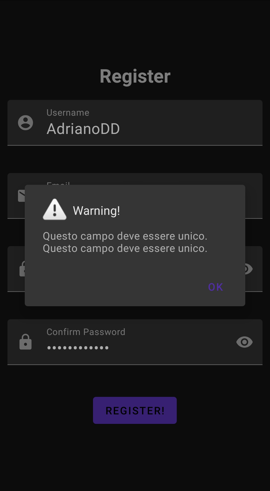
    <br>
    <em>Registration Server errors</em>
</p>

If, instead, fields are valid it will show the following dialog:

<p align="center">
    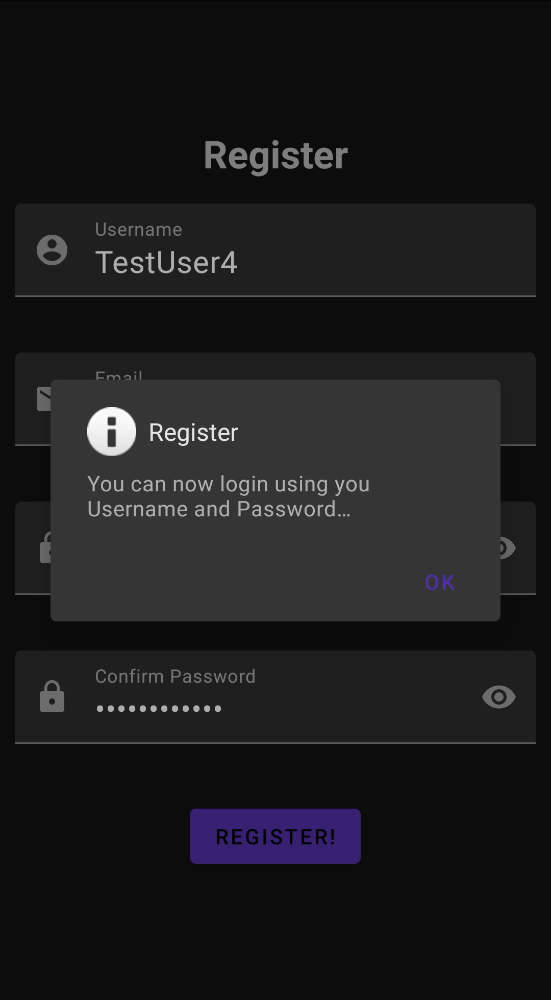
    <br>
    <em>Registration Succeded</em>
</p>

informing the user that he can now login using his username and password.

Login
-----
After typing the username/password in the Main UI,server will check
if user exists and if it does a new activity is launched showing
the user's private area.

Biometric Login
---------------
Biometric Login is enabled only after a successful enrollment has been
done in the settings and it is a simple button in the Main UI:

<p align="center">
    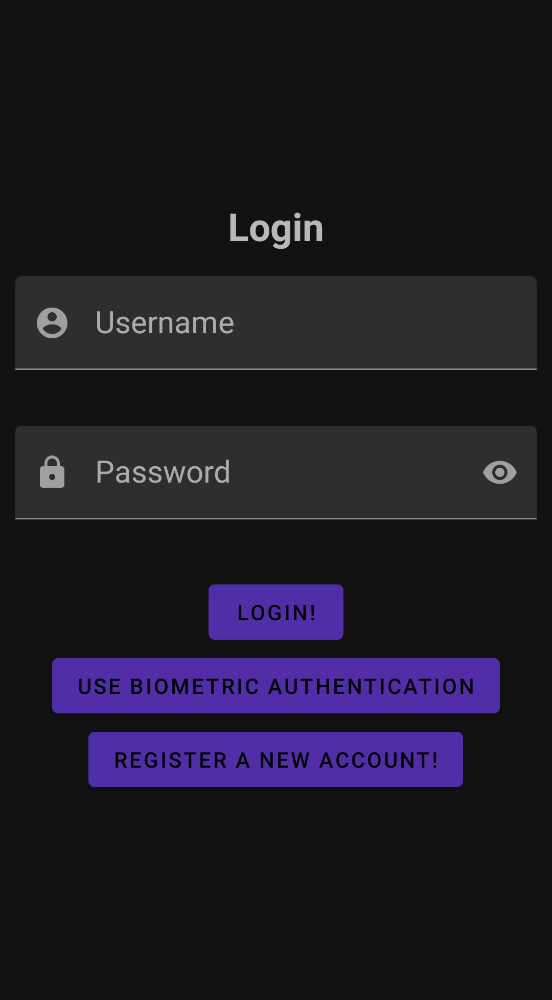
    <br>
    <em>Biometric Login</em>
</p>

After pressing the button user will be asked to confirm his identity with
a standard Android dialog:

<p align="center">
    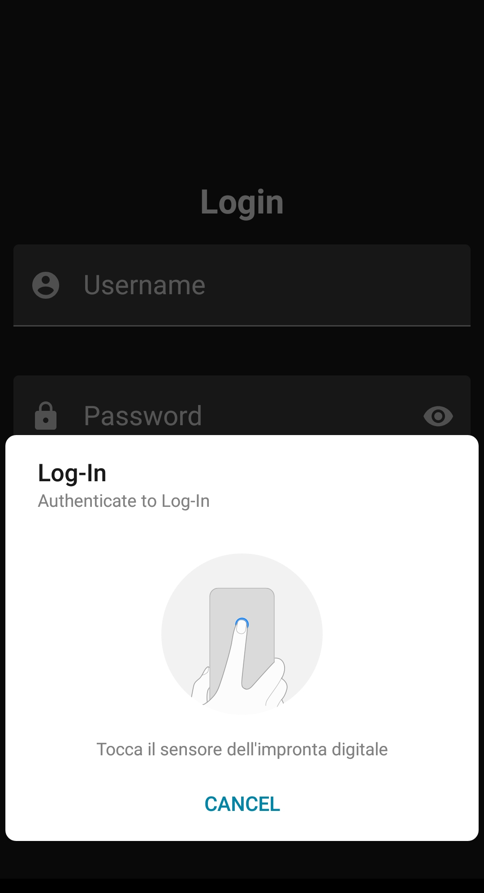
    <br>
    <em>Fingerprint Login</em>
</p>

**Note that on some devices it can use Face Authentication instead of
fingerprint**

If the biometric login succeed, the user will be presented with a new
activity is launched showing the user's private area.

Personal Area
-------------

In this activity user can see his own information,refresh it or logout
as seen in the following picture:

<p align="center">
    
    <br>
    <em>Main User Area</em>
</p>

Below there is a navigation bar that let the user switch between his
information and the application's settings:


<p align="center">
    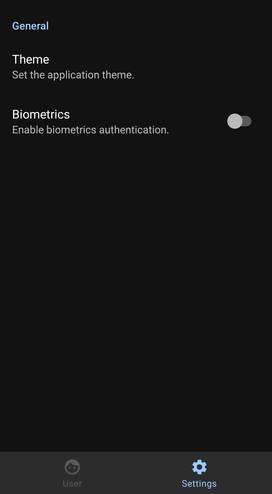
    <br>
    <em>Application's Settings</em>
</p>

In this ui, user can select the default theme (Dark or Light) and enable
biometric authentication.

Refresh
------
This button will update the data by asking the server to refresh
it.

Logout
------
This button will let the user close his own session by clearing out
all the personal data that were received upon login:

<p align="center">
    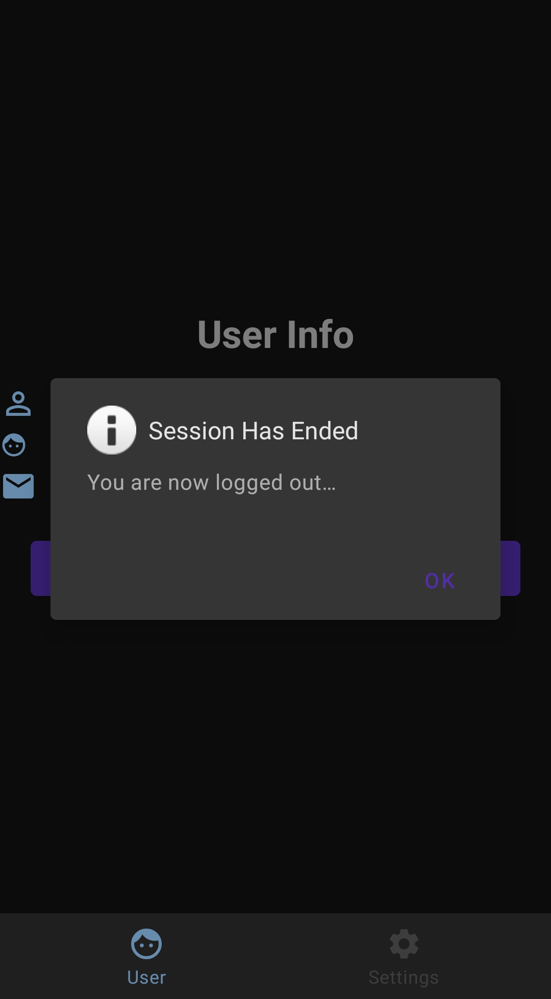
    <br>
    <em>Logout</em>
</p>

Biometric Enrollment
--------------------
When enabling biometrics authentication user will be prompt to
authenticate itself using the standard ui dialog as seen in
the [biometric login](#biometric-login):

<p align="center">
    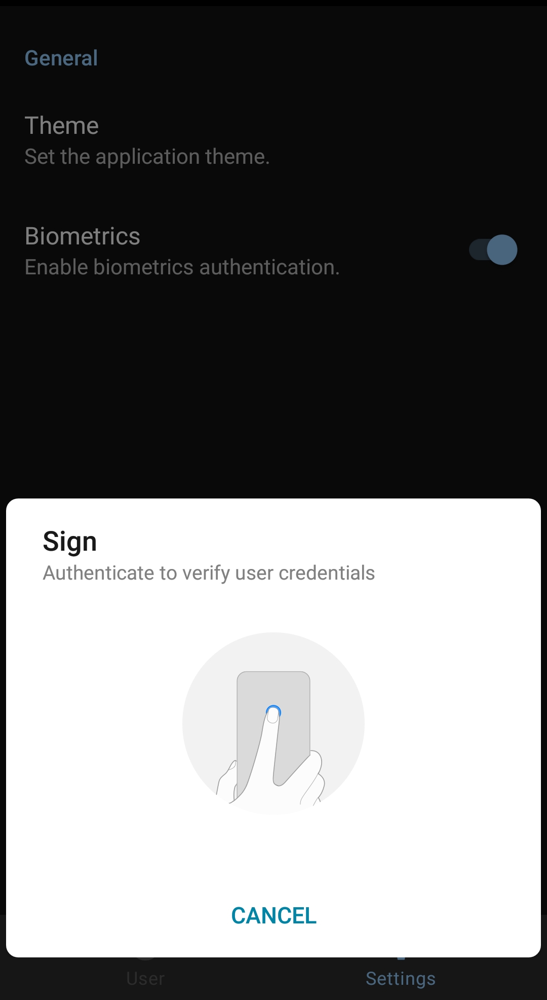
    <br>
    <em>Biometrics Enrollment Authentication</em>
</p>

As said before this dialog will change based on the device and can
ask for different authentication type (Fingerprint,Face etc...).
If the process went well user will be informed with the following
dialog:

<p align="center">
    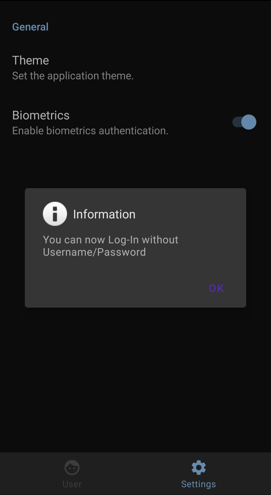
    <br>
    <em>Biometrics Enrollment Succeded</em>
</p>

The next time user will open the application, biometric authentication
will be enabled.

Architecture
============
This package uses retrofit library to implement all the required
API calls.

POJO
----
POJO objects, a.k.a Plain Old Java Object, are an implementation
of the JSON response coming from the server.
Retrofit API will parse the JSON data and put into this object.

In order to implement a specific REST service
an interface that describe all the endpoints must be declared,
as seen below:
```java

@POST("login")
@FormUrlEncoded
Call<LoginPOJO> login(@Field("username") String username, @Field("password") String password);

@POST("biometricLogin")
@FormUrlEncoded
Call<LoginPOJO> biometricLogin(@Field("userId") Integer userId,
                               @Field("biometricToken") String biometricToken);
@POST("login/refresh")
@FormUrlEncoded
Call<RefreshAuthTokenPOJO> refresh(@Field("refresh") String refreshToken);

@POST("register")
@FormUrlEncoded
Call<RegisterPOJO> register(@Field("username") String username, @Field("email") String email,
                            @Field("password") String password);
@GET("userDetails")
Call<UserPOJO> getUserDetails();

@POST("getBiometricToken")
@FormUrlEncoded
Call<BiometricTokenPOJO>
getBiometricToken(@Field("signedBiometricChallenge")
                  String signedBiometricChallenge,
                  @Field("nonce") Integer nonce,
                  @Field("publicKey") String publicKey);

@GET("getBiometricChallenge")
Call<BiometricAuthenticationChallengePOJO> getBiometricChallenge();

@POST("logout")
@FormUrlEncoded
Call<Void> logout(@Field("refresh") String refreshToken);
```

This interface is then used to make real calls to the REST service.

Authenticator
--------------
Since the backend's API uses OAuth2.0 that has a short-lived JWT
access token, every protected call like getUserDetails() would fail
due to the access token being expired.
In order to avoid this situation, okhttp
(the http client used by retrofit) has an utility function to add
an authenticator.
Authenticator's job is to attempt to refresh the access token every
time a protected endpoint request returns 401 (Unauthorized).
When such request is returned then authenticator steps in and make
another request to the refresh endpoint using the refresh token
(obtained during login) and getting a new access token that is passed
to the unauthorized request, simplifying the need to call the refresh
endpoint manually and it can be seen in below snippet:
```java
retrofit2.Response<RefreshAuthTokenPOJO> retrofitResponse;

Retrofit retrofit = pyAuthBackendRESTClient.instanceRetrofitClient(false);
retrofitResponse = retrofit.create(PyAuthBackendRESTAPI.class).
        refresh(pyAuthBackendRESTClient.getRefreshToken()).execute();

RefreshAuthTokenPOJO refreshAuthTokenPOJO = retrofitResponse.body();
if (retrofitResponse.isSuccessful() && refreshAuthTokenPOJO != null) {
    //Tries to grab a new access token
    pyAuthBackendRESTClient.updateAccessToken(
    refreshAuthTokenPOJO.getAccess());
    //Retries the old request that has failed...
    return response.request().newBuilder()
        .header("Authorization", "Bearer " + refreshAuthTokenPOJO.getAccess())
        .build();
}
return null;
```

Biometric Prompt
----------------
Android comes with a library called androidx.biometric that makes
easy to implement a biometric prompt in order to either verify
the user or access the keystore.
It shows a default dialog like the one seen in the
[biometric login](#biometric-login) and in this application
is always used in combination with a CryptoObject.
A CryptoObject is a container for any kind of operation that requires
access to the Private Key stored in the KeyStore.

Android KeyStore
----------------
The android KeyStore is used to generate and store an RSA keypair
in a secured enviroment that is not accessible by any user.
This application generates a new RSA keypair with the following
parameters:
```java
Calendar expirationDate = Calendar.getInstance();
expirationDate.add(Calendar.MONTH,6);
keyPairGenerator.initialize(new KeyGenParameterSpec.Builder(
        keyStoreAlias,
        KeyProperties.PURPOSE_ENCRYPT | KeyProperties.PURPOSE_DECRYPT |
                KeyProperties.PURPOSE_SIGN | KeyProperties.PURPOSE_VERIFY)
        .setEncryptionPaddings(KeyProperties.ENCRYPTION_PADDING_RSA_OAEP)
        .setSignaturePaddings(KeyProperties.SIGNATURE_PADDING_RSA_PKCS1)
        .setDigests(KeyProperties.DIGEST_SHA256,
                    KeyProperties.DIGEST_SHA384,
                    KeyProperties.DIGEST_SHA512)
        .setUserAuthenticationRequired(true)
        .setKeyValidityEnd(expirationDate.getTime())
        .build());
```
It is important to note that setUserAuthenticationRequired make sure
that the private key (or any operation that involves using it) can be
used only after the user has authenticated itself using a
[BiometricPrompt](#biometric-prompt).
This KeyPair has a validity of 6 months after which the user will
be asked to enroll again in order to enforce security.

Biometrics Enrollment Flow
------------------------------
This process triggered by enabling the biometric authentication switch
in the [settings](#biometric-enrollment) and uses two API endpoints
to complete the process.
First step is to ask for a biometric challenge to the server.
When the server returns it, the private key is retrieved from the
keystore:
```java
keyStore.getKey(keyStoreAlias, null);
```
and a CryptoObject is intanced to initialize the signature operation:
```java
Signature signature = Signature.getInstance("SHA256WithRSA");
signature.initSign(privateKey);
biometricPrompt.authenticate(biometricPromptInfo,
                new BiometricPrompt.CryptoObject(signature));
```
this will trigger the biometric authentication dialog seen in
the [settings](#biometric-enrollment).
When the user has confirmed his identity, a request containing the
signed challenge (which was modified by adding a nonce to prevent replay
attacks) is made.
This request uses the public key which is available trough the KeyStore:

```java
keyStore.getCertificate(keyStoreAlias).getPublicKey();
```

Public Key is sent to the server,encoded as Base64,
which verifies the signature of the challenge using the public key and
returns, if the signature was correct,the encrypted biometricToken
encoded as Base64.
Finally, biometricToken is stored encrypted as it is inside the
application's preferences file along with the UserId.
An overall schema of the whole process is shown below:

<p align="center">
    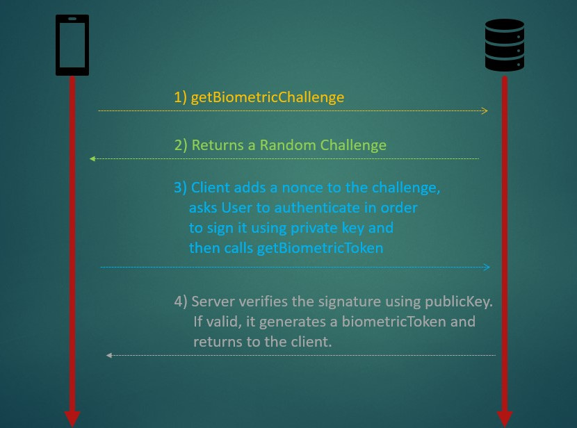
    <br>
    <em>Biometrics Enrollment Protocol</em>
</p>

Biometric Login Flow
--------------------
When Biometric Login is enabled user can login without
typing any username/password.
In order to do so, application must follow a specific flow in
order to authenticate the user.
Since we need to decrypt the biometricToken stored inside the
application's preferences file we need to show a
[BiometricPrompt](#biometric-prompt) that authorize the usage of
the private key in order to decrypt the token:
```java
Cipher cipher = Cipher.getInstance("
          RSA/ECB/OAEPWithSHA-256AndMGF1Padding");
OAEPParameterSpec oaepParameterSpec = new OAEPParameterSpec("SHA-256",
        "MGF1",
        MGF1ParameterSpec.SHA1,
        PSource.PSpecified.DEFAULT);
keyStore.getKey(keyStoreAlias, null);
cipher.init(Cipher.DECRYPT_MODE, privateKey, oaepParameterSpec);
biometricPrompt.authenticate(biometricPromptInfo, new
                  BiometricPrompt.CryptoObject(signature));
```
If the result of the authentication is positive then the encrypted
token can be obtained by using this CipherObject:
```java
decodedBiometricToken = Utils.decodeBase64(biometricToken);
decryptedBiometricToken = authenticationResult.
          getCryptoObject().getCipher().
          doFinal(decodedBiometricToken);
```
Finally the decrypted token along with the user id is sent to the server
in order to verify it's integrity.
